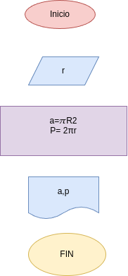

# Programa 1: area_perimetro_circulo
programa en python para calcular el area del perimetro de un circulo, dado el valor de su radio

## Análisis

### Variables de entrada
- r: radio del circulo

### procesamiento 
- a: area del circulo 
- p: perimetro del circlo

$a = \pi*r²$

$p = 2*\pi*r$

## Diseño

## construcción
- codigo implementado en el archivo area_perimetro_circulo.py